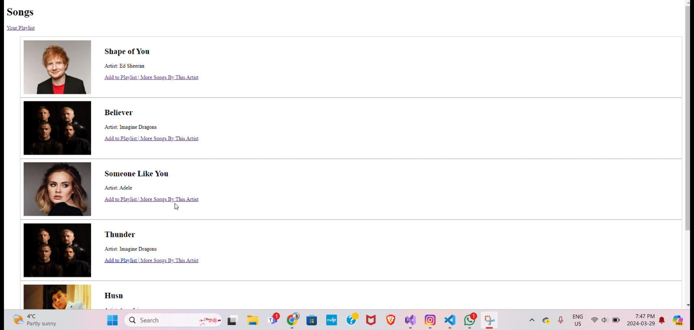
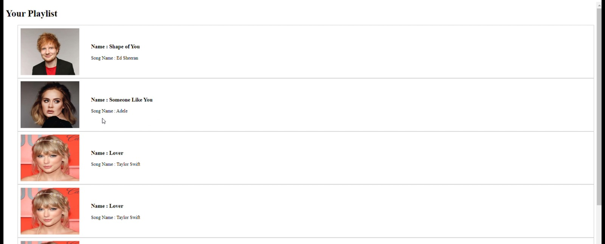
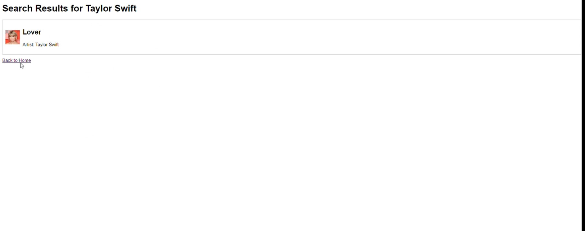

# Music Playlist Manager

The Music Playlist Manager is a Node.js-based web application that allows users to explore a collection of songs, search for music by artist, and manage a personalized playlist. This project demonstrates the use of Express.js for backend routing, EJS as the templating engine, and basic HTML/CSS for frontend design.

# Features

1. View Songs
Display a list of songs with their title, artist, and an image of the artist.
Each song entry has options to:
Add the song to the playlist.
Find more songs by the same artist.

3. Search Songs by Artist
View all songs by a specific artist.
Display a message if no songs are found for the selected artist.

3. Manage Playlist
Add songs to your personalized playlist from the main song list.
View all songs added to your playlist.
Display a message when the playlist is empty.

# Tech Stack

Backend
Node.js: JavaScript runtime for the backend.
Express.js: Framework for routing and server-side logic.

Frontend
EJS: Templating engine for dynamic content rendering.
HTML & CSS: Structure and styling of the web pages.

```
# Project Structure:
Music-Playlist-Manager/
├── views/
│   ├── index.ejs      # Home page to display all songs
│   ├── find.ejs       # Search results page for songs by an artist
│   └── playlist.ejs   # Playlist page
├── server.js            # Main server file
└── .gitignore           # Git ignore file to exclude node_modules
```

# Endpoints Overview

/
Displays all songs available in the application.
Allows users to add songs to the playlist or search for more songs by a specific artist.

/find/:NameofArtist
Displays all songs by the specified artist.
Shows a message if no songs are found for the artist.

/playlist
Displays all songs added to the user's playlist.
Shows a message if the playlist is empty.

/add/:position
Adds a song to the playlist based on its position in the main song list.

# Steps to run the project:

Clone the repository:
git clone https://github.com/DhruvChotalia/Music_Playlist_Manager_WEB.git

Navigate to the project directory:
cd music-playlist-manager

Install dependencies:
npm install

Start the server:
node server.js

Open your browser and navigate to:
http://localhost:3000

# Screenshots:
Home Page:
Displays a list of songs with options to add to the playlist or search for more songs by the same artist.


Playlist Page
Displays all songs added to the playlist or a message if the playlist is empty.


Search Results Page
Shows all songs by a specific artist or a message if no songs are found.


# Acknowledgments

Node.js for the runtime environment.
Express.js for simplifying server-side logic.
EJS for dynamic content rendering.
Placeholder Images used for artist visuals.